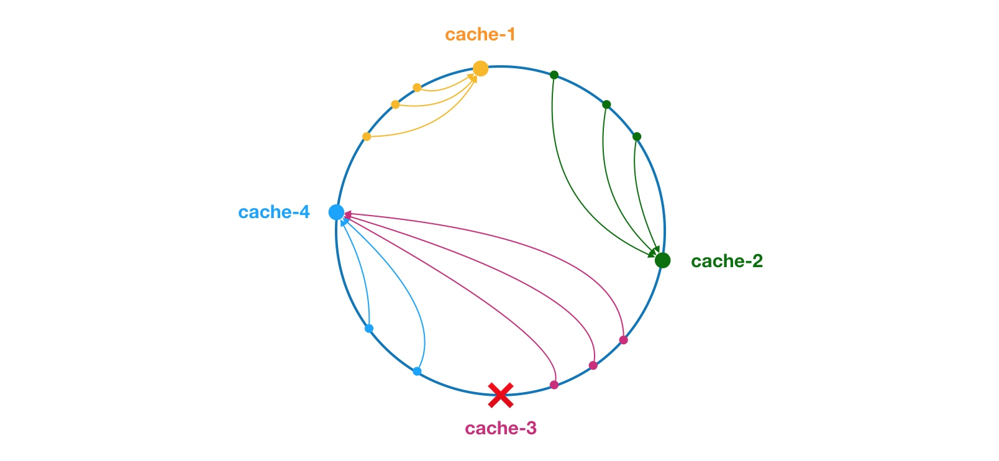

# mini-rpc-framework

mini-rpc-framework 是结合了个人对 RPC 框架的原理，及基于 Netty+Kyro+Zookeeper 而实现的一款轻量级 RPC 框架。(致敬 Dubbo 框架)

## Dubbo 原理

Dubbo 官方文档写的非常清楚，详细 建议参考 <https://dubbo.apache.org/>。

### 分层/整体设计


从功能属性上来划分，Dubbo可划分为三层:

* 业务逻辑层/Business层: 提供接口和实现还有一些配置信息;
* RPC层: 封装整个RPC的调用过程、负载均衡、集群容错、代理;
* Remoting层: 提供网络传输和数据转换.

更细节的划分为 十层: 

* Service 业务逻辑层: 提供接口和实现;
* config 配置层: 对外配置接口，以 ServiceConfig, ReferenceConfig 为中心，用于初始化配置信息;
* proxy 服务代理层: 生成服务的客户端 Stub 和服务器端 Skeleton, 以 ServiceProxy 为中心;
* registry 注册中心层: 封装服务地址的注册与发现，以服务 URL 为中心;
* cluster 路由层: 封装多个提供者的路由及负载均衡，并桥接注册中心，以 Invoker 为中心;
* monitor 监控层: RPC 调用次数和调用时间监控，以 Statistics 为中心;
* protocol 远程调用层: 核心层，封装 RPC 调用，以 Invocation, Result 为中心;
* exchange 信息交换层: 封装请求响应模式，同步转异步，以 Request, Response 为中心;
* transport 网络传输层: 抽象 mina 和 netty 为统一接口，以 Message 为中心;
* serialize 数据序列化层: 数据的序列化和反序列化;

整个分层依赖由上至下，除开business业务逻辑之外，其他的几层都是SPI机制。

### 工作原理


1. 服务启动的时候，服务提供者(provider)和服务消费者(consumer)根据配置信息，连接到注册中心(register)，分别向注册中心注册和订阅服务;
2. 注册中心(register)根据服务订阅关系，返回服务提供者(provider)信息给消费者(consumer)，同时consumer会把信息缓存到本地。如果信息有变更，consumer会收到来自注册中心(register)的推送;
3. 消费者(consumer)生成代理对象，同时根据负载均衡策略，选择一台服务提供者(provider)，同时定时向监控服务(monitor)记录接口的调用次数和时间信息;
4. 生成代理对象之后，消费者(consumer)通过代理对象发起接口调用;
5. 服务提供者(provider)收到请求后对数据进行反序列化，然后通过代理调用具体的接口实现;

### 服务暴露的流程


1. 在容器启动的时候，通过ServiceConfig解析标签，创建标签解析器来解析dubbo的配置文件，容器创建完成之后，触发ContextRefreshEvent事件回调开始暴露服务;
2. 通过ProxyFactory获取到invoker，invoker包含了需要执行的方法的对象信息和具体的URL地址;
3. 再通过Protocol的实现把包装后的invoker转换成exporter，然后启动服务器server，监听端口;
4. 最后RegistryProtocol保存URL地址和invoker的映射关系，同时注册到服务中心

### 服务引用的流程


1. 首先客户端根据配置文件信息从注册中心订阅服务;
2. Protocol根据订阅的得到provider地址和接口信息(ReferenceConfig类)连接到服务端server，开启客户端client，然后创建invoker;
3. 通过invoker为服务接口生成代理对象，这个代理对象用于远程调用服务provider

### 负载均衡策略



负载均衡的职责是将网络请求，或者其他形式的负载“均摊”到不同的机器上。避免集群中部分服务器压力过大，而另一些服务器比较空闲的情况。通过负载均衡，可以让每台服务器获取到适合自己处理能力的负载。

Dubbo 提供了4种负载均衡实现，分别是基于权重随机算法的 RandomLoadBalance(加权随机)、基于最少活跃调用数算法的 LeastActiveLoadBalance(最小活跃数)、基于 hash 一致性的 ConsistentHashLoadBalance(一致性hash)，以及基于加权轮询算法的 RoundRobinLoadBalance(加权轮询)。

1. 加权随机: 假设我们有一组服务器 servers = [A, B, C]，他们对应的权重为 weights = [5, 3, 2]，权重总和为10。现在把这些权重值平铺在一维坐标值上，[0, 5) 区间属于服务器 A，[5, 8) 区间属于服务器 B，[8, 10) 区间属于服务器 C。
2. 最小活跃数: 活跃调用数越小，表明该服务提供者效率越高，单位时间内可处理更多的请求。此时应优先将请求分配给该服务提供者。
3. 一致性hash: 
4. 加权轮询: 所谓轮询是指将请求轮流分配给每台服务器。

### 集群容错方式


为了避免单点故障，现在的应用通常至少会部署在两台服务器上。这时会出现一个问题，服务消费者需要决定选择哪个服务提供者进行调用。另外服务调用失败时的处理措施也是需要考虑的，是重试呢，还是抛出异常，亦或是只打印异常等。Dubbo 提供了多种集群实现，包含但不限于 Failover Cluster、Failfast Cluster 和 Failsafe Cluster 等。

* Failover Cluster - 失败自动切换: 在调用失败时，会自动切换 Invoker 进行重试。
* Failfast Cluster - 快速失败: 只会进行一次调用，失败后立即抛出异常。适用于幂等操作，比如新增记录。
* Failsafe Cluster - 失败安全: 一种失败安全的 Cluster Invoker。所谓的失败安全是指，当调用过程中出现异常时，FailsafeClusterInvoker 仅会打印异常，而不会抛出异常。适用于写入审计日志等操作。
* Failback Cluster - 失败自动恢复: 调用失败后，返回一个空结果给服务消费者。并通过定时任务对失败的调用进行重传，适合执行消息通知等操作。
* Forking Cluster - 并行调用多个服务提供者: 通过线程池创建多个线程，并发调用多个服务提供者。只要有一个服务提供者成功返回了结果，doInvoke 方法就会立即结束运行。在一些对实时性要求比较高读操作（注意是读操作，并行写操作可能不安全）下使用，但这将会耗费更多的资源。
* Broadcast Cluster - 广播: 逐个调用每个服务提供者，如果其中一台报错，在循环调用结束后，会抛出异常。通常用于通知所有提供者更新缓存或日志等本地资源信息。

## 怎么设计一个RPC框架？

最简单的 RPC 框架应该是这样: 服务提供者 Provider 向注册中心注册服务，服务消费者 Consumer 通过注册中心拿到服务提供者相关信息，然后通过网络请求服务提供者。

1. 首先需要一个服务注册中心，这样consumer和provider才能去注册和订阅服务，推荐使用 Zookeeper。
2. 需要通信协议和工具框架，比如通过http或者rmi的协议通信，推荐基于 NIO 的 Netty 框架。
3. 数据的传输序列化要考虑，JDK 自带的序列化效率低并且有安全漏洞。 所以，比较推荐常用的有 hession2、kyro、protostuff。
4. 设计负载均衡的机制来决定consumer如何调用客户端，当然还要包含容错和重试的机制。
5. 设计一个RPC协议，用于服务消费者与提供者通信。

## 常见RPC框架

Dubbo、Motan、gRPC...

### Dubbo

Apache Dubbo(incubating)是一款高性能、轻量级的开源Java Rpc框架，阿里开源、后来加入了Apache。，有三大核心特性:

* 面向接口的远程方法调用
* 集群容错和负载均衡
* 服务自动注册和发现

### Motan

Motan 是新浪微博在2016年开源的一款Rpc框架，不过网上的资料比较少，使用的公司也蛮少的。

### gRPC

gRPC是 Google 开源的一款高性能、通用的开源RPC框架。主要面向移动应用并基于HTTP/2协议标准而设计，基于 ProtoBuf 序列化协议开发，并支持多语言。

### Thrift

Apache Thrift 是 Facebook 开源的跨语言的RPC框架，并且在很多互联网公司应用。

### 总结

gRPC 和 Thrift 虽然支持跨语言，但它们只提供了最基本的RPC功能，没有配套的服务化组件和服务治理组件支撑。

Dubbo 在功能上、生态系统和社区活跃度上都是最好的。对于以 Java 为后端技术栈的公司，十分推荐 Dubbo。

## 准备工作

### 下载运行 zookeeper

使用 Docker 来下载安装:

```shell script
docker pull zookeeper:3.5.8

docker run -d --name zookeeper -p 2181:2181 zookeeper:3.5.8
```

更多ZooKeeper内容 请参考 [ZooKeeper相关](doc/ZooKeeper相关.md)
